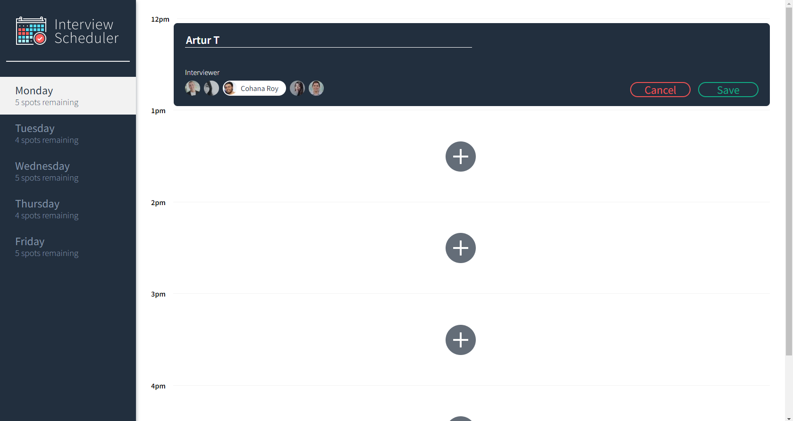
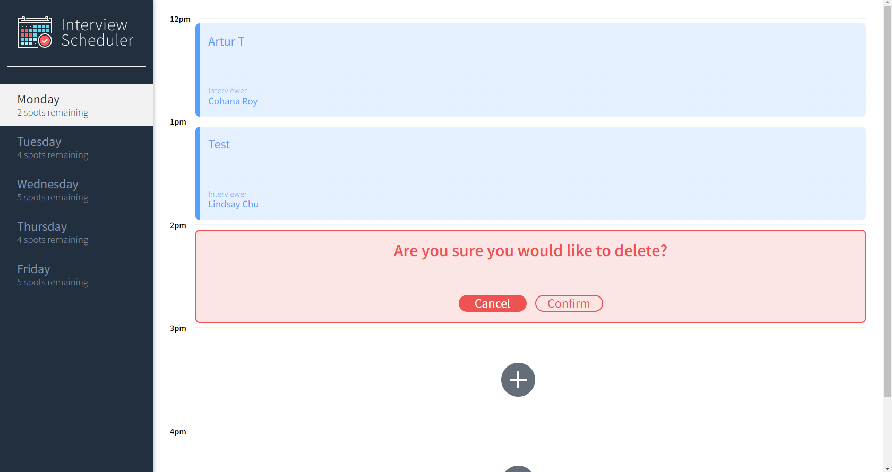
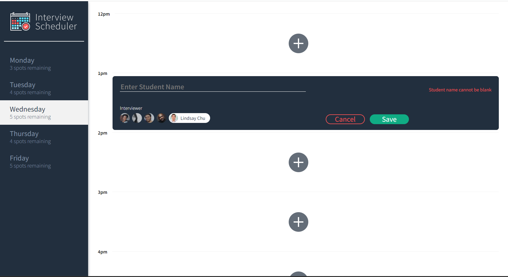
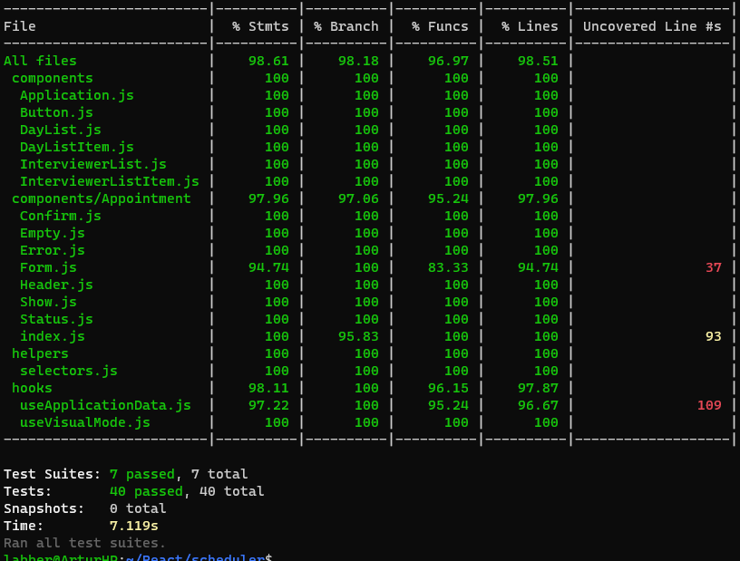

# Interview Scheduler

Welcome to Interview Scheduler! This project is a single-page application (SPA) built with React that allows users to book and cancel interviews. The application provides a real-time experience by combining a concise API with a WebSocket server.
This project was build as a part of [Lighthouse Labs.](https://www.lighthouselabs.ca/) educational program

## Project Description
Interview Scheduler is designed to facilitate technical interviews between students and mentors. Users can book appointments between 12 PM and 5 PM, Monday to Friday. Each appointment consists of one student and one interviewer. When creating a new appointment, the user can enter any student name, while the interviewer is selected from a predefined list. The application allows users to save appointments, view the entire schedule on any given day, edit existing appointments, and delete appointments.

The frontend of the project is built using React and communicates with an API to fetch and store appointment data from a database.

### Project view
___

Creating appointment


Deleting appointment


Fields required messsage

___

## Testing practice

In this project, we also practice testing using [Jest](https://jestjs.io/) and [Cypress](https://www.cypress.io/) 

Test coverage


___
### User Requirements
The Interview Scheduler application satisfies the following user requirements:

* Interviews can be booked between Monday and Friday.
* Users can switch between weekdays.
* Users can book interviews in empty appointment slots.
* Interviews are booked by entering a student name and selecting an interviewer from a list.
* Users can cancel existing interviews.
* Users can edit the details of existing interviews.
* The list of days indicates the number of available slots for each day.
* The available spots update dynamically when an interview is booked or canceled.
* Users are shown a confirmation when attempting to cancel an interview.
* Users receive an error message if an interview cannot be saved or deleted.
* Users see a status indicator while asynchronous operations are in progress.
* When closing an error message, users are returned to the Form or Show view, skipping Status and Confirm.
* The application uses API requests to load and persist data, ensuring data is not lost after a browser refresh.

### Dependencies:
* ```React```: A JavaScript library for building user interfaces.
* ```Axios```: A promise-based HTTP client for making API requests.
* ```@testing-library/react```: A library for testing React components.
* ```react-dom```: A package that provides DOM-specific methods for React.
* ```react-scripts```: A set of scripts and configuration used by Create React App (CRA) for development and building React applications.
* ```Prettier```: Code formatter for consistent code style.
* ```Sass```: CSS preprocessor with advanced features.
* ```Babel```: JavaScript compiler for using modern syntax.
* ```Storybook```: UI component development environment.

___
## Setup

Install dependencies with `npm install`.

## Running Webpack Development Server

```sh
npm start
```

## Running Jest Test Framework

```sh
npm test
```

## Running Storybook Visual Testbed

```sh
npm run sb
```
